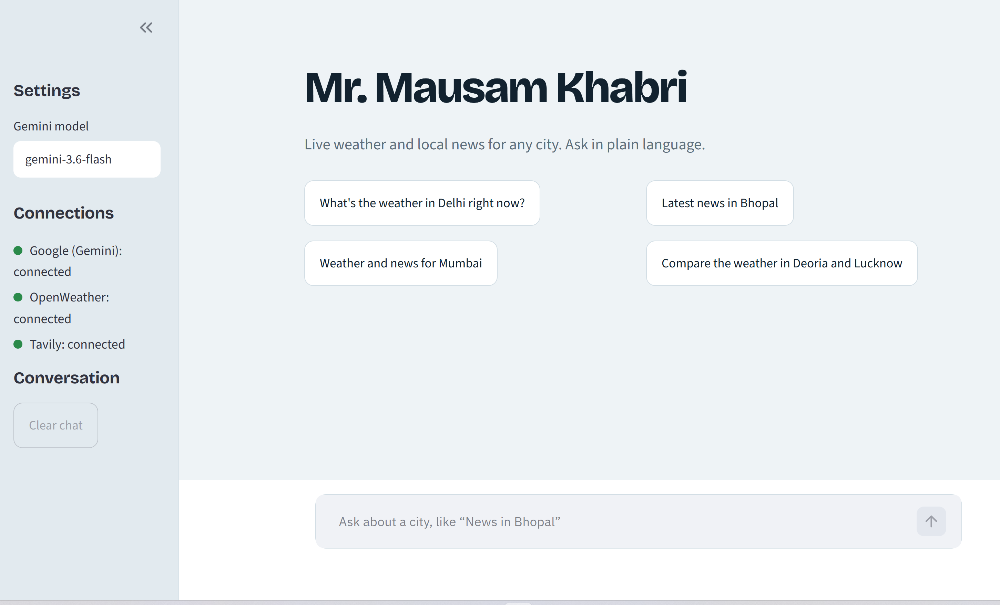

# City Intelligence

Ask about any city and get the **current weather and the latest local news**, all in one chat.

I built this project to learn how AI agents work with tools. The assistant, **Mr. Mausam Khabri**, decides on its own whether to check the weather, look up the news, or do both, then combines the information into a simple and natural response. The chat UI also shows which tools were used for each answer.

---

## Features

- 🌤️ Live weather for any city (OpenWeather API)
- 📰 Latest local news with source links (Tavily API)
- 💬 Conversation memory for follow-up questions
- 🔧 Tool indicators showing which tools the agent used
- ⚠️ Clear error messages for missing API keys or failed requests
- 💻 Terminal mode for text-only interaction

---

## UI

---

## Live Demo

👉 [**Try Mr. Mausam Khabri Live**](https://your-live-demo-url.com)

Ask about:

- 🌤️ Current weather of any city
- 🌡️ Temperature, humidity, wind, UV index, and more
- 📰 Latest news of a city or area

---

## Tech Stack

- Python
- LangChain
- Google Gemini
- Streamlit
- OpenWeather API
- Tavily API

---

## Project Structure
**
City_Intelligence/
├── app.py              # Streamlit chat UI
├── agent.py            # Agent setup and tools
├── requirements.txt
├── .env                # API keys (not committed)
└── README.md
**
---

## Getting Started

### 1. Clone the Repository

git clone <your-repository-url>
cd City_Intelligence

### 2. Create a Virtual Environment

*python -m venv .venv*

##Activate it:

**Windows**
-> .venv\Scripts\activate

**macOS / Linux**
-> source .venv/bin/activate

### 3. Install Dependencies

pip install -r requirements.txt

---

## Add API Keys

Create a `.env` file in the project root:

- GOOGLE_API_KEY=your_google_api_key
- OPENWEATHER_API_KEY=your_openweather_api_key
- TAVILY_API_KEY=your_tavily_api_key

Get your API keys here:

- Google Gemini: https://aistudio.google.com/apikey
- OpenWeather: https://openweathermap.org/api
- Tavily: https://tavily.com

---

## Run the Application

-> streamlit run app.py

#For terminal mode:

-> python agent.py

Type `exit` to quit.

---

## Example Questions

- What's the weather in Delhi right now?
- Latest news in Bhopal
- Weather and news for Mumbai
- Compare the weather in Deoria and Lucknow
- What's the humidity in Jaipur?
- Show me the latest news from Lucknow

---

## Changing the Model

The default model is set in `agent.py`:

DEFAULT_MODEL = "gemini-3.6-flash"

You can also change the model from the sidebar settings in the Streamlit app.

---

## Notes

- Never commit your `.env` file.
- Add `.env` and `.venv/` to `.gitignore`.
- OpenWeather API keys may take some time to activate.

---

Made with ❤️ using LangChain, Gemini, OpenWeather, and Tavily.

